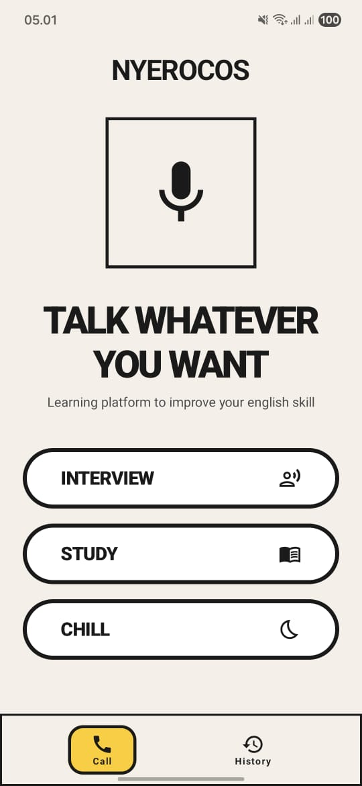
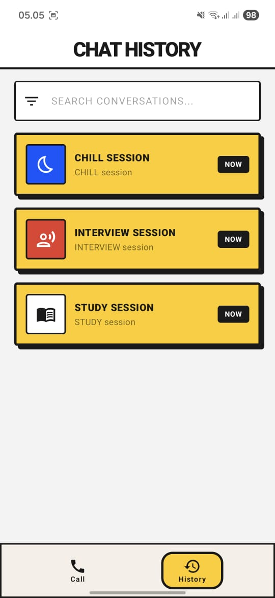

# Nyerocos 🗣️

> **On-Device AI English Tutor**
> 
> *Bold, raw, and unapologetic. An offline-first English speaking companion.*

**Nyerocos** adalah aplikasi mobile Android *offline-first* yang berfungsi sebagai tutor bahasa Inggris berbasis suara. Menggunakan model LLM lokal (On-Device AI) untuk menciptakan lingkungan latihan *speaking* yang aman, tanpa *judgement*, gratis, dan tanpa latensi jaringan.

## 🎨 Design & Screenshots (Neo-Brutalist)

Nyerocos mengadopsi bahasa desain **Bauhaus — Neo-Brutalist**. Desainnya fokus pada fungsi ("Form Follows Function") dengan kontras tinggi, geometri kuat, dan ketidaksempurnaan yang disengaja. Tidak ada bayangan halus atau *glassmorphism*—semuanya solid, tebal, dan ekspresif.

  
  &nbsp;&nbsp;&nbsp;&nbsp;
  
  &nbsp;&nbsp;&nbsp;&nbsp;
  

## ✨ Fitur Utama (Core Features)

- 🎙️ **Zero-Latency Voice Conversation**: Komunikasi dua arah instan berkat pemrosesan *On-Device*.
- 🧠 **Local LLM Engine**: Berjalan sepenuhnya *offline* menggunakan model Gemma 4 terkuantisasi (4-bit).
- 🔒 **Privacy-First**: Karena tidak ada internet yang diperlukan, data audio dan percakapan Anda tidak pernah meninggalkan perangkat.
- 🎯 **Multiple Modes**:
  - *Casual Talk*: Ngobrol santai untuk melancarkan *speaking*.
  - *Grammar Focus*: AI akan fokus mengoreksi *grammar*.
  - *Job Interview*: Simulasi wawancara kerja (Tech/Umum).
- 📊 **Evaluasi Otomatis**: Ringkasan *grammar* dan rekomendasi perbaikan setelah sesi selesai.

## 🛠️ Spesifikasi Teknis (Tech Stack)

| Komponen | Teknologi | Keterangan |
| :--- | :--- | :--- |
| **Bahasa & UI** | Kotlin, Jetpack Compose | Native Android, Arsitektur MVVM |
| **Local LLM Engine** | Google AI Edge SDK / MediaPipe | Eksekusi inferensi model lokal |
| **Model AI** | Gemma 4 (E2B) - 4-bit Quantized | Model ringan (.tflite / .bin) |
| **Speech-to-Text** | Android SpeechRecognizer API | Native, tanpa *delay* server |
| **Text-to-Speech** | Android TextToSpeech (Media3) | *Engine* suara bawaan sistem |
| **Database** | Room Database | Penyimpanan riwayat obrolan & *grammar notes* |

## ⚙️ Alur Kerja Sistem (Data Pipeline)

Aplikasi Nyerocos memproses data dalam hitungan milidetik secara *on-device*:

1. **Input Stage**: Pengguna menekan tombol "Hold to Speak". `MediaRecorder` menangkap audio.
2. **STT Processing**: Suara diubah menjadi teks melalui `SpeechRecognizer`.
3. **Context Assembly**: Teks digabung dengan *System Prompt* (instruksi tutor) & riwayat *chat*.
4. **LLM Inference**: Diproses oleh **Gemma 4** di memori perangkat.
5. **TTS Processing & Output**: AI merespons dengan teks, yang dibaca oleh `TextToSpeech` sembari menampilkan teks di layar dengan efek *typing*.

## 🚀 Getting Started

### Prasyarat (Prerequisites)
- Android Studio Ladybug atau yang lebih baru.
- Perangkat Android dengan **minimum RAM 8GB** (disarankan) untuk menjalankan LLM lokal.
- Android 7.0 (API level 24) ke atas.

### Build & Run
1. *Clone* repositori ini.
2. Buka proyek di Android Studio.
3. Sinkronisasi Gradle (`build.gradle.kts`).
4. (Opsional) Aplikasi akan mengunduh model LLM (1-2 GB) pada saat pertama kali dijalankan (*Onboarding*).
5. Jalankan aplikasi pada perangkat fisik (Emulator mungkin terlalu lambat untuk inferensi AI).

---
*Built with ❤️ for a better, offline English learning experience.*
